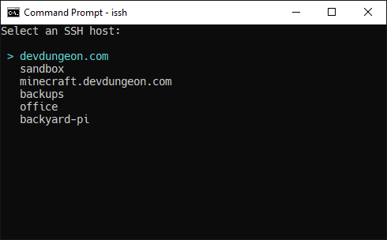

# issh

[](https://pypi.org/project/issh/)

Improved SSH launcher that provides a browsable
menu of SSH servers. Uses `~/.ssh/config`
to generate menu.

For more tips on using SSH and the configuration file, check out [https://www.devdungeon.com/content/ssh-tips](https://www.devdungeon.com/content/ssh-tips)



## Install

Install from pypi.org using:

```bash
python -m pip install issh
```

Install from source by running this from
the root of the source code directory:

```bash
python setup.py install
```

## Usage

Simply run `issh` from the command line to launch
the menu.

```bash
issh
```

Or invoke via Python:

```bash
python -m issh
```

To use the tool inside PYthon source code:

```python
from issh import ISSH

issh = ISSH()
issh.run()
```

## Controls

- `Esc` or `q`: Quit
- `Enter`, `l`, or `Right Arrow`: Connect
- `j` or `Down Arrow`: Down
- `k` or `Up Arrow`: Up
- `e`: Edit SSH config file

When using the Edit (`e`) command, it tries to use
the editor defined in `EDITOR` environment variable,
otherwise attempts to default to a system editor. 

## Troubleshooting

If you have permission errors with the `~/.ssh/config` file,
make sure the `.ssh/` directory has `700` permissions and
the `config` file has `600` permissions. Also ensure
the owner is correct.

## Author

NanoDano <nanodano@devdungeon.com>

## To do

- On right, show the config details
